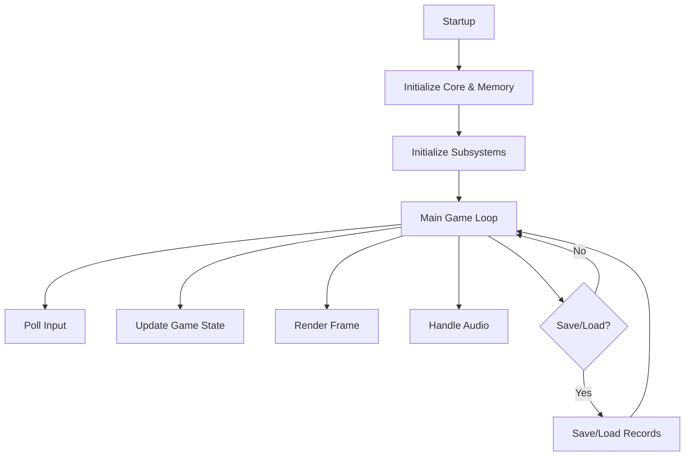

# PO-X-Style Core Test Program Architecture  
## For Modern 64-bit Handhelds with Variable Record Sizes

---

## 1. Overview

This document describes the architecture for a portable PO-X-style core test program, designed for modern 64-bit handheld devices. The system supports variable record sizes (X, Y, Z bytes) and is suitable for advanced game handheld computer systems.

---

## 2. System Components

### 2.1 Core Emulator Layer

- **CPU Emulation:**  
  - 64-bit RISC-V or ARM core abstraction.
  - Modular instruction set, supporting legacy PO-X and extended opcodes.
- **Memory Management:**  
  - Dynamic allocation for variable record sizes (X, Y, Z bytes per record).
  - Memory-mapped I/O for peripherals.
- **Record System:**  
  - Flexible data structures for save states, player data, and assets.
  - Serialization/deserialization for variable-length records.

### 2.2 Platform Abstraction Layer

- **Input/Output:**  
  - Abstracted for touch, physical buttons, and sensors.
- **Display:**  
  - SDL2/OpenGL ES for cross-platform graphics.
- **Audio:**  
  - Modular audio pipeline, supporting modern codecs.

### 2.3 Game Logic Layer

- **Main Loop:**  
  - Handles input, updates game state, renders output.
- **Subsystems:**  
  - Creature/character management.
  - Inventory and resource systems.
  - Combat and world simulation.

---

## 3. Example Data Flow

1. **Startup:**  
   - Initialize core, memory, and all subsystems.
2. **Game Loop:**  
   - Poll input → update game state → render frame → handle audio.
3. **Save/Load:**  
   - Serialize all variable-length records.

---

## 4. Portability & Extensibility

- **Modular C++ (or Rust) codebase.**
- **Abstract interfaces for platform-specific code.**
- **Record system supports future expansion (e.g., new data types, larger records).**

---

## 5. Testing & Validation

- **Unit tests** for CPU, memory, and record logic.
- **Integration tests** for save/load, variable record handling, and game logic.
- **Performance profiling** on target 64-bit handheld hardware.

---

## 6. Example Code Snippets

### Core Emulator Initialization (C++)
```cpp
CoreEmulator core;
core.init(cpu_type::ARM64);
core.load_rom("game.rom");
```

### Variable Record Save/Load
```cpp
Record rec;
rec.data = {0x01, 0x02, 0x03}; // X bytes
save_manager.save_record("player", rec);
Record loaded = save_manager.load_record("player");
```

### Platform Abstraction Example
```cpp
InputEvent evt = platform.get_input();
if (evt.type == InputType::ButtonPress) {
  // Handle input
}
```

---

## 7. Security & Data Integrity

- All save/load operations use checksums (e.g., CRC32) to detect corruption.
- Sensitive data (e.g., player progress) can be encrypted using platform APIs.
- Input validation and bounds checking are enforced throughout the codebase.

---

## 8. System Flow Diagram



---

## 9. Roadmap & Future Features

- Add scripting support (Lua, Python) for modding.
- Expand record system for cloud sync and multiplayer.
- Integrate advanced graphics (Vulkan, Metal) for next-gen handhelds.
- Add accessibility features (text-to-speech, high-contrast modes).
- Continuous integration and automated testing for all platforms.

---

## 10. Summary

This architecture enables a flexible, portable PO-X-style core for modern handhelds, with advanced features like variable record sizes. The design supports both legacy compatibility and future expansion for innovative gameplay and hardware integration.

---
