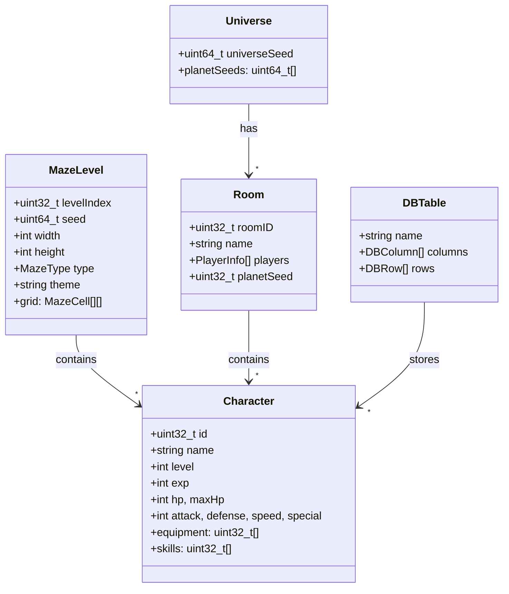

# POX Game System UML Overview

---

- See docs/ARCHITECTURE.md for more details on system relationships.
- See docs/GAME_DATABASE.md, docs/MAZE_SYSTEM.md, and docs/CONFIG_SYSTEM.md for subsystem documentation.
